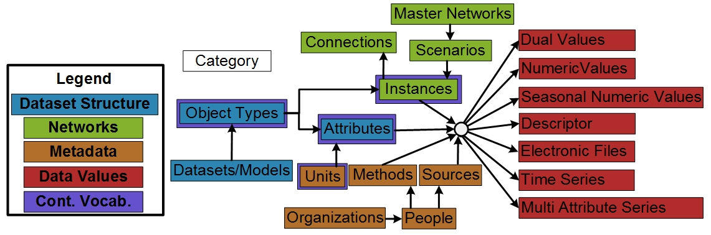

# WaMDaM_Information_Model

The Water Management Data Model (WaMDaM) is information model to organize water management data with contextual metadata and controlled vocabulary for multiple datasets and models. WaMDaM is implemented in a relational model and works for SQLite, MySQL, PostgreSQL, and Microsoft SQL Server. 

## 1. Information Model Concepts and their description

The documentations of the model and its design are found at [docs.wamdam.org](http://docs.wamdam.org/DesignDocumentation/Desing_Req/)

## 2. Entity Relationship diagrams for WaMDaM schema 1.04

* Check out the interactive [WaMDaM schema or entity relationship diagram][1].   
The HTML site files are generated by DbWrench and hosted in the [docs][21] folder   
* Here is the [XML DbWrench schema file][2]  

## 3. Key earlier drafts of WaMDaM designs
* Check out the [Key earlier WaMDaM ER diagrams versions since inception][20]

[1]:http://schema.wamdam.org/diagrams/01_WaMDaM.html  
[2]:/XML_schema  
[20]:/Earlier_ER_diagrams
[21]:/docs

## 4. Script to create blank WaMDaM databases OR copies of db to restore 
* [Microsoft SQL Server](database_schemas/MS_SQL_Server)
* [MySQL](database_schemas/MySQL)
* [PostgreSQL](/database_schemas/PostgreSQL)
* [SQLite](/database_schemas/SQLite)

## 5. Use the DDL Utility here to create DDL for SQLite, MySQL, PostgreSQL, and Microsoft SQL Server from one XML file. 
[DDL Generator Utility][10]

[10]:https://github.com/WamdamProject/WaMDaM_DDL_generator

--------------------------------------------------------------------------------------------------------------------------
### Use the WaMDaM Wizard to load water management data from Excel and other sources into WaMDaM database 
The [WaMDaM Wizard][3] is an open-source, cross-platform, Python-based graphical user software to interact with WaMDaM database. By using the Wizard, users are not expected to understand the underlying WaMDaM database of schema

[3]:https://github.com/WamdamProject/WaMDaM_Wizard

### Controlled Vocabularies
View and the [WaMDaM online moderated registry][4] which aims to promote consistent terminology (i.e., Controlled Vocabularies-(CVs)) to describe water system components and their attributes across datasets, models, and users, while still retaining the native terms. Registering your model's native terms against these CVs will allow you to relate, query, and compare all of your water management data within a single database. Submit new terms to support your data and expand the registery. Check out the [registry souce code][]  

[4]:https://github.com/WamdamProject/WaMDaM_ControlledVocabularies
[5]:http://vocabulary.wamdam.org

### Licensing  
WaMDaM and materials in this GitHub repository are disturbed under a BSD 3-Clause [LICENSE](/LICENSE). 
For alternative licensing arrangements, contact Adel M. Abdallah or David E. Rosenberg directly.    

### Sponsors and Credit  
WaMDaM and related software development have been developed under funding from several different sources. It was primarily supported by the National Science Foundation <a href="http://www.nsf.gov/awardsearch/showAward?AWD_ID=1135482" target="_blank">CI-Water Project</a> and later from the <a href="https://www.nsf.gov/awardsearch/showAward?AWD_ID=1208732" target="_blank">iUtah Project</a>. 
Any opinions, findings, and conclusions or recommendations expressed in this material are those of the author(s) and do not necessarily reflect the views of the National Science Foundation.    

WaMDaM has been developed at and also additionally funded by the Utah Water Research Lab at Utah State University, Logan Utah during the period of August, 2012-2017. Thanks to Dr. Steven Burian at the Unviversity of Utah, Salt Lake City Utah for hosting Adel Abdallah as a visiting scholar 2014-2017.  

